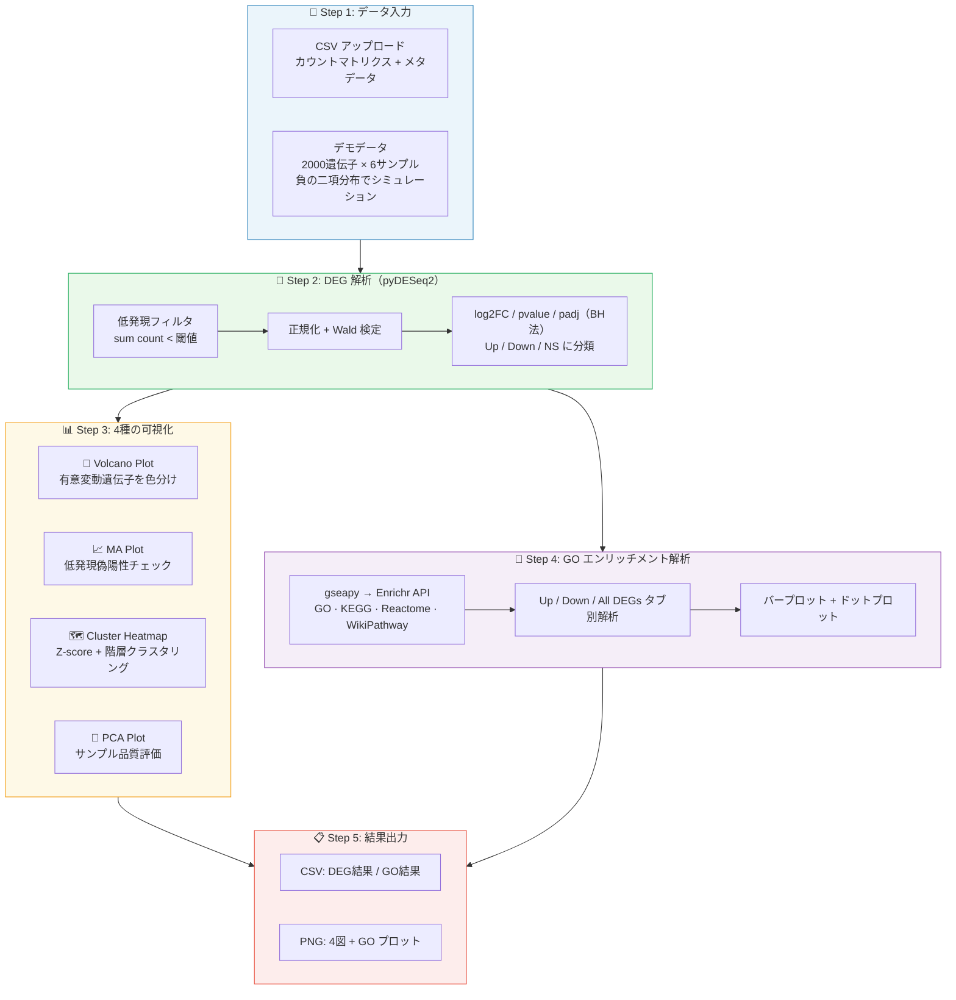

# bulk-rnaseq-deg-analyzer

bulk RNA-seq カウントデータから差次発現遺伝子（DEG）を統計検定し、4種の標準可視化と GO エンリッチメント解析までを Python のみで一気通貫実行する Streamlit Web アプリ。

> **bulk RNA-seq 専用** — 組織・血液サンプル等の集団平均発現量を対象とした 2 群比較に特化しています。シングルセル RNA-seq（scRNA-seq）とは異なる統計モデルを使用しています。

---

## 解決した課題

RNA-seq 実験後に「どの遺伝子が有意に変動しているか」を調べるには、従来 R/DESeq2 + RStudio という独立した環境が必要で、ウェットラボ研究者には高い技術ハードルがあった。

本ツールは **2群×3反復（Control 3 / Treatment 3）** という bulk RNA-seq の典型的な実験デザインに最適化し、低発現フィルタ → 正規化 → Wald 検定 → 多重検定補正（BH 法）という標準パイプラインを Python だけで自動実行する。さらに「この DEG 群は何に関わっているか」という生物学的解釈も、GO / KEGG パスウェイ解析まで同一ツール内で完結させた。

---

## 主要機能

- **DEG 統計検定（pyDESeq2）** — 負の二項分布モデルによる R/DESeq2 同等の精度。低発現フィルタ・正規化・BH 法多重検定補正を自動処理し、log2FoldChange / pvalue / padj を出力
- **4種の標準可視化** — Volcano Plot（有意変動遺伝子の概観）/ MA Plot（低発現偽陽性チェック）/ Cluster Heatmap（上位 DEG の発現パターン + 階層クラスタリング）/ PCA Plot（サンプル品質評価・外れ値検出）
- **GO / パスウェイ エンリッチメント解析** — gseapy を通じた Enrichr API 接続で GO BP / MF / CC / KEGG / Reactome / WikiPathway の 6 ライブラリに対して Over-Representation Analysis を実行。Up / Down / All DEG を方向別に解析
- **インタラクティブなパラメータ調整** — adjusted p-value / |log2FC| 閾値・ヒートマップ表示遺伝子数・低発現フィルタをサイドバーからリアルタイムに変更可能
- **デモデータ内蔵 + 全出力ダウンロード** — 実データ不要で全機能を即座に確認可能。DEG 結果 / GO 結果 CSV、Volcano / MA / Heatmap / PCA の PNG を個別ダウンロード

---

## 技術スタック

| カテゴリ | 使用技術 |
|---|---|
| Web UI | Streamlit — インタラクティブ GUI・session_state によるステート管理 |
| DEG 検定 | pyDESeq2 — DESeq2 の Python 実装（負の二項分布 + Wald 検定 + BH 補正） |
| パスウェイ解析 | gseapy — Enrichr API 経由の ORA（GO / KEGG / Reactome / WikiPathway）|
| 可視化 | matplotlib（Volcano / MA / PCA）+ seaborn clustermap（階層クラスタリングヒートマップ）|
| 次元削減 | scikit-learn — `PCA` + `StandardScaler` によるサンプル品質評価 |
| データ処理 | pandas / numpy — CPM 正規化・Z-score 算出・統計量計算 |
| インフラ | Streamlit Cloud — `packages.txt` により build-essential / gfortran / libopenblas-dev を自動インストール |

---

## アーキテクチャ



本アプリは単一ファイル `rnaseq_deg_app.py`（約 775 行）で構成される。解析は `st.button` による明示的なトリガーで実行され、結果は `st.session_state` に保持されることでパラメータ変更時の再解析を防いでいる。

| セクション | 役割 |
|---|---|
| サイドバー（全体） | DEG 解析 / GO 解析の全パラメータをレイアウト |
| `generate_demo_data()` | 負の二項分布で 2000 遺伝子 × 6 サンプルを生成。先頭 50 遺伝子を Up-regulated、次の 50 を Down-regulated に設定し DEG 検出を保証 |
| Step 2 解析ブロック | pyDESeq2 の `DeseqDataSet` / `DeseqStats` を呼び出し、結果を `session_state` に保存 |
| Step 3 可視化ブロック | `session_state` 参照のみ。Heatmap は log₂CPM → Z-score、PCA は StandardScaler → PCA の 2 段階処理 |
| `generate_mock_go_results()` | `Gene_XXXX` 形式検出時にモック GO 結果を生成（実在 GO タームを使用） |
| `run_enrichr()` | 実 HUGO シンボル検出時の `gseapy.enrich()` API 呼び出し |

---

## 使用方法

### セットアップ

```bash
git clone https://github.com/TSUBAKI0531/bulk-rnaseq-deg-analyzer.git
cd bulk-rnaseq-deg-analyzer

pip install -r requirements.txt

streamlit run rnaseq_deg_app.py
# → http://localhost:8501
```

### デモ実行（実データ不要）

1. 「✅ デモデータを使用する」が ON の状態で **▶ 解析を実行** をクリック
2. 2000 遺伝子 × 6 サンプル（Control 3 / Treatment 3）の合成データで全パイプラインが動作します
3. GO エンリッチメント解析では `immune response` / `JAK-STAT cascade` 等の実在 GO タームを使ったモック結果を表示します

### 実データ解析

**カウントマトリクス CSV**（行: 遺伝子名、列: サンプル名）

```csv
,Sample_1,Sample_2,Sample_3,Sample_4,Sample_5,Sample_6
TP53,120,135,118,450,520,480
IL6,45,52,48,320,380,355
```

**メタデータ CSV**（`sample` 列と `condition` 列が必須）

```csv
sample,condition
Sample_1,Control
Sample_4,Treatment
```

> HUGO 遺伝子シンボル（TP53, BRCA1 等）を使うと Enrichr API で本物の GO 解析が動作します。TSV 形式（`.tsv`）にも対応しており、拡張子で自動判定します。

---

## 設計上の工夫

**bulk RNA-seq 特化の統計モデル**
scRNA-seq 用の scanpy / Seurat とは異なり、組織・血液サンプルの集団平均発現を扱う bulk RNA-seq に設計された負の二項分布モデルを採用。pyDESeq2 は R 版 DESeq2 の統計的手法を Python で忠実に再実装しており、BH 法による多重検定補正まで同等の処理を保証している。

**可視化の正規化戦略**
Heatmap は log₂(CPM+1) でライブラリサイズ差を補正した後、行方向 Z-score でサンプル間の相対変動のみを映し出す。PCA は `StandardScaler` で各遺伝子の分散を均一化し、高発現遺伝子による軸の支配を防いでいる。

**ボルカノ / MA プロットの補完設計**
ボルカノプロットは「有意かつ変動量の大きな遺伝子」の把握、MA プロットは「低発現遺伝子での偽陽性チェック」という異なる目的を持つ。両プロットで同じ `color_map` と上位 10 遺伝子ラベルを共有し、読み手に一貫した視覚表現を提供している。

**デモ / 実データの GO 解析自動切替**
遺伝子名の先頭 10 件が `Gene_XXXX` 形式かを検出し、デモ時は実在 GO タームを使ったモック結果を返す。実データ（HUGO シンボル）では自動的に Enrichr API へ切り替わり、追加の設定なしに本物のアノテーションを取得する。

**session_state による再解析の抑制**
解析結果（`results_df`, `count_filtered`, `meta_subset`）を `st.session_state` に保持し、サイドバーのパラメータ変更では DEG 検定を再実行しない。パラメータに基づく色分けと閾値ラインのみが即時更新され、重い計算の不要な反復を回避している。

---

## 今後の拡張可能性

- **GSEA（ランクベース解析）対応** — 全遺伝子の log2FC をランクとして使う Gene Set Enrichment Analysis を追加し、DEG 閾値設定に依存しない解析へ
- **多群比較対応** — pyDESeq2 の Likelihood Ratio Test を利用した 3 群以上の比較と pairwise contrast 出力に拡張
- **バッチ効果補正の統合** — ComBat / Harmony を前処理ステップとして組み込み、多施設・多バッチの RNA-seq データに対応
- **Plotly インタラクティブ図** — マウスオーバーで遺伝子情報（機能 / OMIM）を表示するインタラクティブ版へ切替

---

## ライセンス

MIT License

---

## Author

GitHub: [@TSUBAKI0531](https://github.com/TSUBAKI0531)
